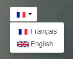

# Grav Language Selector Plugin



`Language Selector` is a [Grav](http://github.com/getgrav/grav) plugin that provides native language selector with flags to switch between [Multiple Languages](http://learn.getgrav.org/content/multi-language).

# Installation

Installing the Language Selector plugin can be done only manually for this moment. GPM  installation is not yet available

## Manual Installation (Download)

To install this plugin, just download the zip version of this repository and unzip it under `user/plugins`. Then, rename the folder to `language-selector`. You can find these files either on [GitHub](https://github.com/clemdesign/grav-plugin-language-selector).

You should now have all the plugin files under

    /yoursite/user/plugins/language-selector


## Manual Installation (Using GIT)

In `user/plugins` folder, apply the following command:
```
git clone https://github.com/clemdesign/grav-plugin-language-selector language-selector
```

This will clone this repository into the _language-selector_ folder.

# Usage

The `Language Selector` plugin doesn't require any configuration. You do however need to add the included Twig partials template into your own theme somewhere you want the available languages to be displayed.

```

```

Something you might want to do is to override the look and feel of the langswitcher, and with Grav it is super easy.

Copy the template file [language-selector.html.twig](templates/partials/language-selector.html.twig) into the `templates` folder of your custom theme:

```
/yoursite/user/themes/custom-theme/templates/partials/language-selector.html.twig
```

You can now edit the override and tweak it however you prefer.

## Usage of the `hreflang` partial

A second template is available for `hreflang` annotations in the header of the page. In order to emit language annotations for the available languages of a page you need to add the corrsponding Twig partial template into the `<head>` section of your page, which can typically be found in `base.html.twig`:

```

```

This will generate something like:

```
<link rel="alternate" href="http://example.com/en" hreflang="en" />
<link rel="alternate" href="http://example.com/fr" hreflang="fr" />
<link rel="alternate" href="http://example.com/zh-cn" hreflang="zh-cn" />
```

# Configuration

## Plugin

Simply copy the `user/plugins/language-selector/language-selector.yaml` into `user/config/plugins/language-selector.yaml` and make your modifications.

```
enabled: true
built_in_css: true
button_display: default
select_display: default
```

Options `enabled` and `built_in_css` are pretty self explanatory.

For `button_display`, this one define how button of selected language will be displayed. There are 3 possibilities:
- `default`: Flag and Language name are displayed
- `flag`: Only flag is displayed
- `name`: Only language name is displayed

For `select_display`, this one define how language selector will be displayed. There are 3 possibilities:
- `default`: Flag and Language name are displayed
- `flag`: Only flag is displayed
- `name`: Only language name is displayed

## Redirecting after switching language

To have Grav redirect to the default page route after switching language, you must add the following configuration to `user/config/system.yaml`
```
pages:
  redirect_default_route: true
```

# Credits

[Language Selector](https://github.com/clemdesign/grav-plugin-language-selector) is based on [Lang Switcher](https://github.com/getgrav/grav-plugin-langswitcher) plugin.
